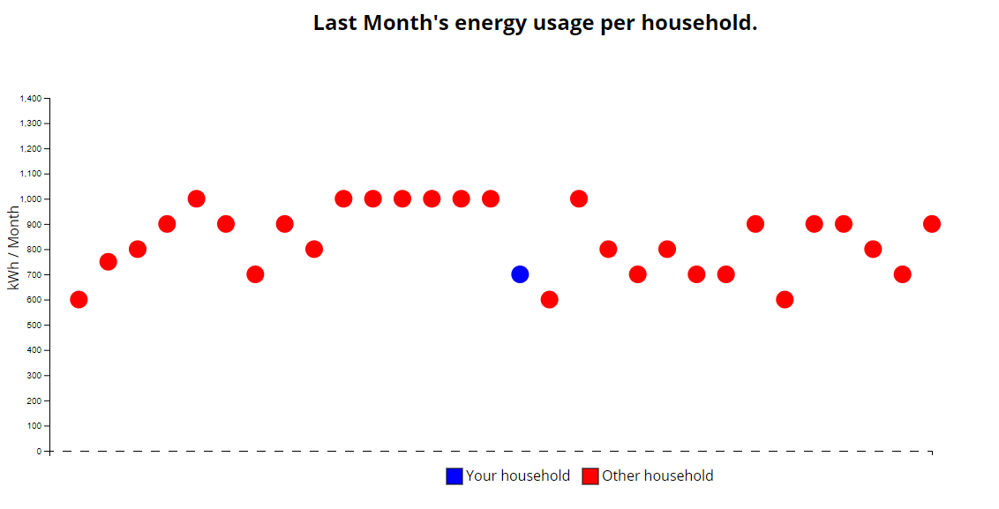

# Visualizations
---

## Peak


```html

<html>
<head>
  <script src="https://d3js.org/d3.v4.min.js"></script>
  <script src="blackHole.js"></script>
</head>
<body>
<center>
  <h2 class="tittle">Last Month's energy usage per household.</h2>
</center>
<div id="chart"></div>
<!-- <script src="b2.js"></script> -->
<script>
  let bh = new BlackHole("../../data/data1.csv")
  let myHouse = 15
  bh.plot("chart", myHouse)
</script>

</body>

</html>
```

```csv
name,y
House1,600
House2,750
House3,800
House4,900
House5,1000
House6,900
House7,700
House8,900
House9,800
House10,1000
House10,1000
House10,1000
House10,1000
House10,1000
House10,1000
House11,700
House12,600
House13,1000
House14,800
House15,700
House16,800
House17,700
House18,700
House19,900
House20,600
House21,900
House22,900
House23,800
House24,700
House25,900
```
